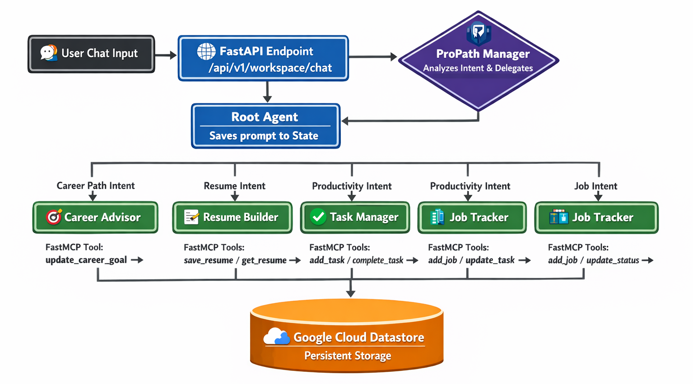
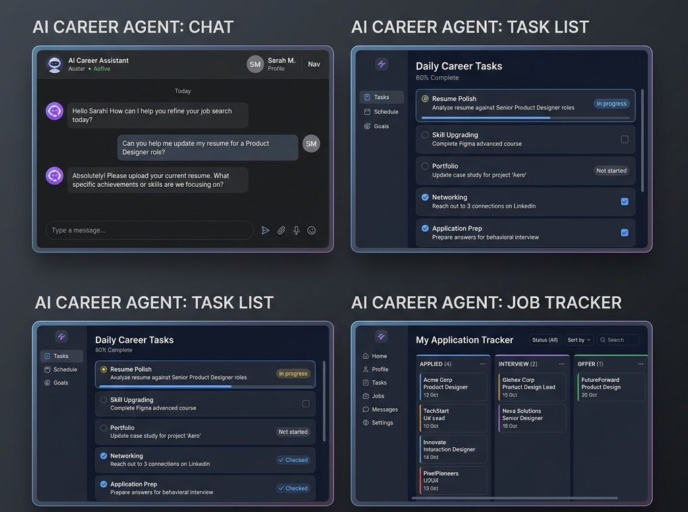
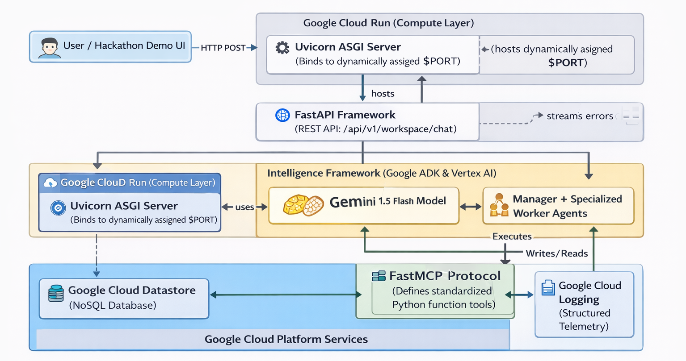
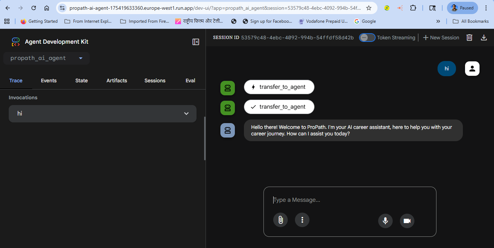

#  ProPath AI
**Your Unified Career, Resume, and Job Tracking "Robo-Manager"**

Welcome to **ProPath AI**—a revolutionary approach to managing your career. We are moving past the era of single-use AI chatbots and entering the era of an automated **Multi-Agent AI Executive Team**.


## 💡 The Problem: "Context-Switching Burnout"
As developers and professionals, applying for jobs is exhausting. You likely juggle:
1. A massive, messy Excel spreadsheet to track applications.
2. Multiple Word documents for different versions of your resume.
3. Random sticky notes or to-do apps to remind you to follow up with recruiters.

This fragmentation leads to burnout and missed opportunities.

##  The Project: One Chat Interface, Four AI Agents



**ProPath AI** solves this fragmentation. Instead of filling out spreadsheet forms or opening documents, you simply chat naturally with the system. Behind the scenes, we built a highly advanced **Manager AI** that listens to you and instantly delegates your requests to four specialized AI workers:

###  1. The ProPath Manager (The Brain)
You only talk to the Manager. It analyzes what you want (e.g., "I applied to Google today!") and routes it to exactly the right sub-agent so you don't have to navigate menus.

###  2. Career Advisor Sub-Agent
Replacing your notebooks. Chat with this AI to define, refine, and securely log your long-term career aspirations.

###  3. Resume Builder Sub-Agent
Replacing Microsoft Word. Tell this agent about a recent project you built, and it will format it to recruitment standards and securely store it as a modular "Experience" section directly in the cloud.

###  4. Task Manager Sub-Agent
Replacing sticky notes. Ask the AI to remind you to "prep for a behavioral interview tomorrow," and it invisibly updates your cloud to-do list so you never forget.

###  5. Job Tracker Sub-Agent
Replacing Excel. Simply say "I got an interview at Acme Corp." The agent extracts the company name, status, and role, automatically updating your persistent job application database.

---

## 💬 Real-World User Experience (UX)



You type **one simple sentence:**
> *"I just applied for an AI Developer role at Cloudflare, please add that to my jobs and remind me to email their recruiter tomorrow."*

**What happens instantly:**
1. Manager AI catches the intent.
2. **Job Tracker Agent** wakes up and logs "Cloudflare - AI Developer - Applied" into the Datastore.
3. **Task Manager Agent** wakes up and adds "Email Cloudflare Recruiter" to your active Task List.
*(Zero data entry required from the user!)*

---

## 🏗️ Technical Implementation (The Backend Magic)



While the user only sees a simple chat interface, the backend is a highly scalable cloud architecture built during the Hackathon:

*   **Orchestration:** `google-adk` and `langchain` securely manage the hand-offs between our Manager AI and the Sub-Agents using the **Gemini 1.5 Flash** model.
*   **Persistent Storage:** `google-cloud-datastore` and `google-cloud-bigquery` are used to ensure that when an agent claims it saved a resume or a task, it actually wrote real, structured NoSQL data to Google Cloud.
*   **Safe Execution:** Using `mcp.server.fastmcp`, the AI is strictly bound to secure Python functions, guaranteeing it cannot hallucinate database updates.
*   **Containerized REST API:** Served over `FastAPI` and `uvicorn`, our Multi-Agent brain is completely decoupled and ready to scale horizontally on Google Cloud Run.

---

## ☁️ Running the Project Locally

**1. Clone & Install**
```bash
git clone https://github.com/your-username/propath-ai.git
cd propath-ai
pip install -r requirements.txt
```

**2. Launch the AI Server**
*(Ensure GCP credentials and Gemini APIs are set in your `.env`)*
```bash
uvicorn agent:app --host 0.0.0.0 --port 8080 --reload
```

**3. Visualizing using Google ADK Inspector**
Once the server is running, the agent routing and thought process can be analyzed live through the ADK interface:



---

## 📜 License
This project is licensed under the MIT License - see the [LICENSE](LICENSE) file for details.

